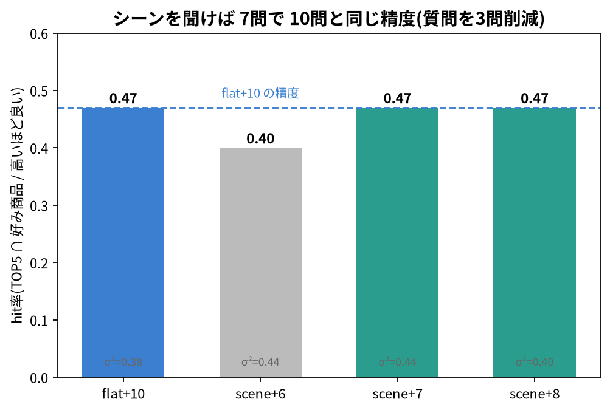
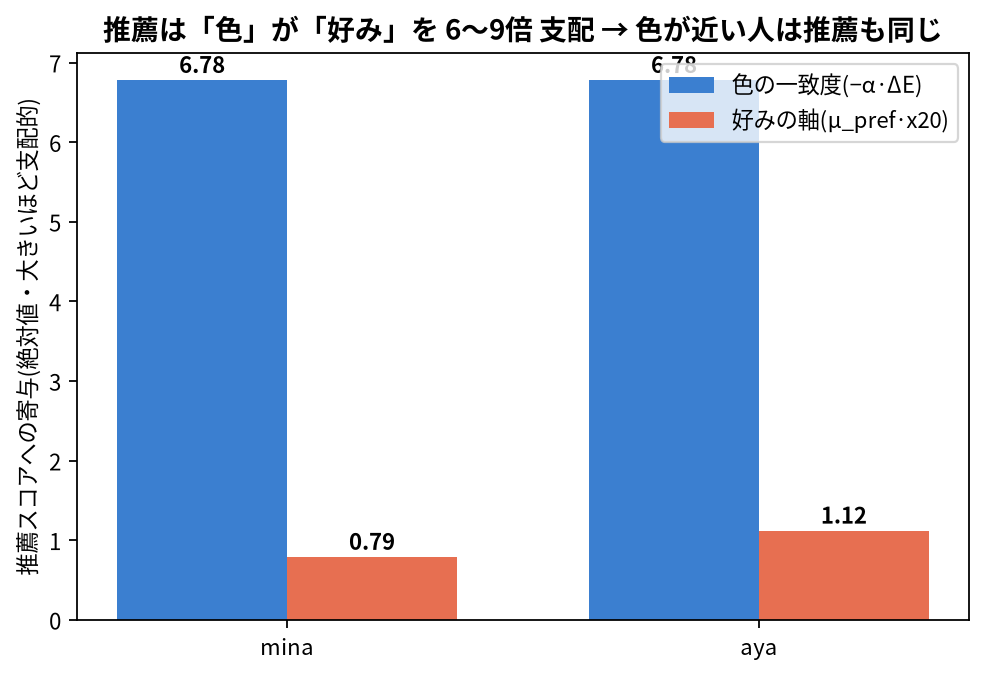
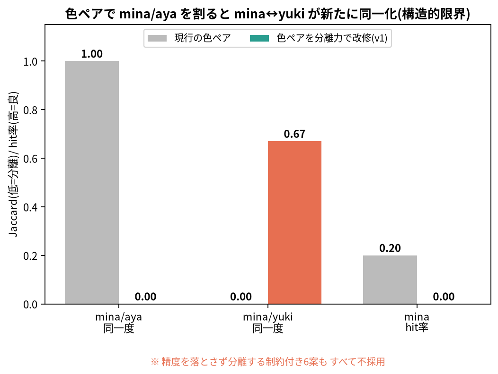
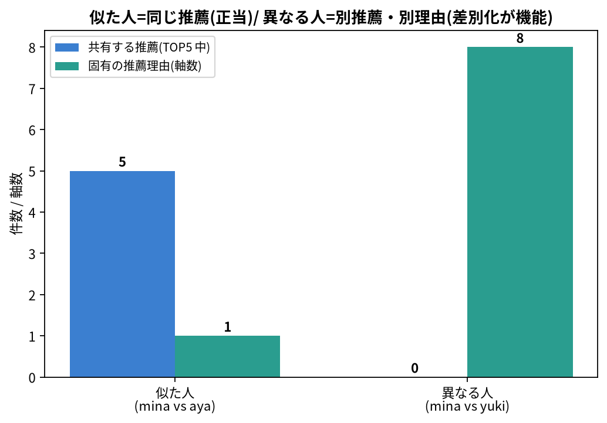

# v14 推薦体験レビュー(Kawano さん協議用)

> **目的(所要 15 分想定)**: v14(推薦体験まわり)の実装が一段落しました。
> **(1) できたことの共有 →(2) 確認してほしいこと →(3) 一緒に決めたいこと →(4) お願い** を1枚に。
> 上から順に追いながら話せます。数値はすべて検証(LOG エポック16)の実測です。

---

## 1. できたこと(報告)

分担(**撮影・AR・質感 = Kawano さん / 推薦体験 = Haruki**)で進めた結果:

- **API**(全 CI green): シーン事前分布 / 推薦理由(reasons)/ 絞り込みカウンタ / 逐次ペア比較(EIG)/ 全体ランキング `/v13/popular` / 唇プレビュー用 `effective_lab`。
- **フロント**(`feat/v14-recommend`・CI tsc green): シーン選択 / 唇プレビュー / コンシェルジュ器 / 購入フロー(shortlist)。
- **Kawano さんのメリット**: データは API から来るので**見せ方に集中**できる。`lipDetection.ts` は**不変**=AR 本実装と衝突しない。再着色は `recolorLips`(純関数)で分離=将来 AR に差し替え可。

検証の中核 ── 問数削減:

→ シーンを最初に聞けば **7問で10問と同じ精度**。質問を3問減らせます。

---

## 2. 確認してほしいこと(決定済み・異論なければ追認)

### 2-1. 色の強制ペアは現行のまま据え置き

検証中に「**色の好みが近いユーザーの推薦が同一化する(collapse)**」現象を発見。原因と判断:

→ 推薦は**色の一致度が好みの軸を 6〜9 倍支配**する。だから色の好みが近い人は推薦も同じになる(=正当)。

→ 色ペアで無理に分けると**別の同一化が起きる**(精度も低下)。精度を保つ制約付き6案も全滅=**構造的限界**。

差別化は順位ではなく**理由 + 本人の最終選択**で作る:

→ 本当に違う人(例: マット好き)には**推薦も理由も明確に別**。差別化は機能しています。

**結論: 色5ペアは現行のまま据え置きで進めます。** → 異論なければ追認をお願いします(詳細根拠 → [`KAWANO_PAIRS_NOTE.md`](KAWANO_PAIRS_NOTE.md))。

### 2-2. 推薦画面の設計判断

- 生スコア(ΔE・θ・r_final)は**表示しない** → reasons とコンシェルジュの語りに置換。
- **shortlist** で本人が最終1本を選ぶ(順位は無理に動かさない=信頼の前提)。
- 「全 N 色 → n 色 → 5 色」の**絞り込みカウンタ**は演出でなく実数(候補数)。

→ 確認: この方向で良いか。MTG の「アンカー4+回転1」は「計算精度を売りに上位固定は矛盾」で全廃済みです。

---

## 3. 一緒に決めたいこと

### 3-1. コンシェルジュのキャラビジュアル(妖精)

器・選択ロジックは実装済み(今はプレースホルダの円+絵文字 🧚)。MTG 合意の妖精キャラの
**ビジュアル(立ち絵 / 表情差分の要否 / サイズ感 / 配置)** を一緒に固めたい。後から画像を差し込める構造です。

---

## 4. お願い

### 4-1. コンシェルジュの発話 3 パターン文面(MTG タスク)

差別化の核が「理由の語り」なので、**文面が入ると体験が大きく変わります**。器に流し込むだけにしてあるので、
シーン × スタイルの3パターン文面の共有をお願いします。**叩き台**(このトーン・粒度・置き換え前提):

- **探索中(手首撮影)**:「内側の血管の色から、似合う色のヒントがわかるんだよ」
- **推薦時(理由)**:「さっき ○問目で透け感のある方を選んでたよね。だからこれ」
- **決定時**:「どっちも似合う圏内だよ。あとは今日の気分で選んで大丈夫」

トーン: 妖精・やわらかいタメ口(`conciergeScript.ts` 冒頭にトーン定義 + 差し替え点 TODO あり)。

### 4-2. フロントの型生成(`gen:api-types`)を一度回す

`openapi.json` は **本セッションで再生成・コミット済み**(`/v14`・`/v13/popular` 等を反映。CI 経由)。
残りは **color-capture 側で `npm run gen:api-types` を一度回す**だけ(新 `openapi.json` → `apiTypes.gen.ts` 再生成)。
現状フロントは v14 型を手書き(`apiTypes.ts`)で暫定対応中=動作はするので、**どちらが・いつ回すか**だけ合わせたい。

---

## 5. 補足: 残課題(Phase 2・今は決めない)

- collapse が**合成ペルソナ固有**か、**実ユーザーデータで再検証**(今はユーザー不在で確定不可)。
- 実 PAIR_BANK に**明度軸**を足す見直しは将来オプション(分離候補は抽出済み・現行は色相/彩度に偏り)。
- `openapi.json` は再生成・コミット済み。残りは §4-2 のフロント `gen:api-types` のみ。

---

## 関連資料

- 色ペアを変えない判断の詳細: [`KAWANO_PAIRS_NOTE.md`](KAWANO_PAIRS_NOTE.md)
- 図一式: `scripts/figures/kawano_*.png`(npairs / collapse / pairfix / reasons / eig〔ばらつき・社内用〕)
- API 仕様: [`KAWANO_INTERFACE.md`](KAWANO_INTERFACE.md)

**不明点・異論はこの場で遠慮なく** — 一緒に詰めましょう。
