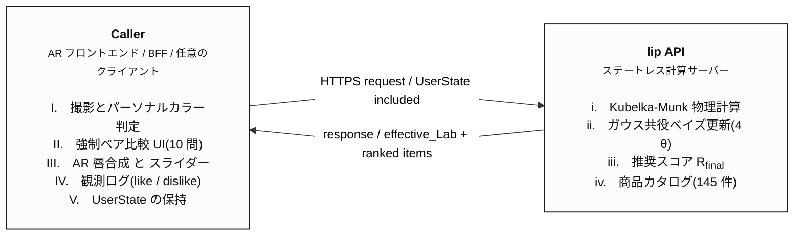

> tamable株式会社で開発中の個人化コスメ推薦システムについて、設計・実装・評価をまとめた技術記事(設計編)。物理シミュレーション(Kubelka-Munk 理論)と階層ベイズ更新を統合し、過去使用商品ゼロ・嗜好未言語化という困難な条件下での個人化推薦を可能にした。本記事は実装が公開されており、再現可能。

## Abstract

本稿は、コスメ経験の乏しい高校生ペルソナを対象とした口紅推薦システムの設計と実装を報告する。主たる課題は (1) 過去使用履歴に依存できない初期嗜好分布の構築、(2) 「商品本来の色」と「ユーザーが塗った時に見える色」のスケール不一致、(3) 言語化困難な嗜好の機械学習可能な形式への変換の 3 点である。本研究は、Kubelka-Munk 理論 [1, 2, 3] による物理ベースの塗布シミュレーション、Color Me Beautiful 4 シーズン理論 [4] に基づくパーソナルカラー Lab 領域の構築、強制ペア比較と階層ベイズ更新による嗜好獲得という、異なる 3 分野の手法を統合することで、これらの課題を解決する。実装はステートレス REST API として公開済みであり、商品 145 件の実カタログに対して 2 つの定量評価を実施した。(i) パーソナルカラー領域マッチングのベースライン精度は 20 評価セルの平均一致率 0.810(MVP 合格ライン 0.70 を超過)。(ii) in silico の 3 ペルソナ並走実験では、同一の事前分布から開始した 3 仮想ユーザーが 10 観測後に互いに重複 0 件の TOP-5 へ分岐し、事後分散 σ² は 20 倍縮小した。全実装と検証コードは GitHub および Hugging Face Spaces で公開している。

## 1. Contributions(本研究の貢献)

1. **物理シミュレーションを推薦ロジック層に統合**: K-M 理論を口紅評価機 [3] でなく**個人化推薦の中核**に組み込み、「ユーザーが実際に見る色」と「推薦計算で使う色」を一致させる
2. **塗り厚軸の連続スカラー化と階層ベイズ更新**: 離散カテゴリ案を棄却し、連続スカラー θ_thickness をガウス共役更新で学習する設計に到達(設計改訂 v1.0 → v1.3)
3. **初心者向け事前分布構築の経路設計**: 過去使用商品入力に依存せず、PC 診断(経路A)+ 強制ペア比較(経路B)+ 軽い対話確認の三経路で事前分布を構築する
4. **ステートレス API としての実装**: caller(AR フロント・GAS・任意 BE)が UserState を保持するため、永続化方式を自由に選べる
5. **数式と実装の対応を CLI で透明化**: `formula` コマンドで本稿 §5 の式に現在値を代入した計算過程と実装出力を並べて一致確認できる(可視性ある検証ツール)

## 2. 問題設定

### 2.1 対象ユーザー

地方在住高校1年生 15 歳、月のコスメ予算 3,000〜5,000 円。中学卒業前後にメイクを始めた初心者であり、(a) 過去使用商品が乏しい、(b) 「ガーリー」「韓国っぽい」「ナチュラル」のどれが自分に合うか言語化できない、(c) 失敗への恐怖が強い、という 3 つの特徴を持つ。SNS 発信欲は強い。

### 2.2 既存推薦システムが機能しない理由

既存のコスメ推薦アプリは多くが (i) 過去購買履歴によるコラボレーティブフィルタリング、(ii) ユーザーの自由テキスト入力によるコンテンツベース、を採用する。前者は履歴ゼロのユーザーに対する cold-start 問題 [5] を抱え、後者は嗜好を言語化できないユーザーには機能しない。

### 2.3 本研究で解く問題

本研究は次の 3 つを解く:
- **P1 (Bootstrap)**: 過去履歴・自由言語化に依存せず、初回診断時点で意味のある初期推薦を生成する
- **P2 (Color Fidelity)**: 商品マスストーン Lab と「実際に唇に塗った時の見え方」のスケール不一致を解消し、推薦計算と AR 表示で同一の色空間を使う
- **P3 (Online Learning)**: 観測経路(ペア比較・AR の like/dislike・スライダー操作)からのオンライン学習で個人嗜好を更新する

## 3. Related Work(関連研究)

### 3.1 Kubelka-Munk 理論

Kubelka-Munk(K-M)理論は、塗料・歯科・ネイル業界で 50 年以上使われている色彩光学の業界標準モデルである [1]。半透明塗膜の反射率予測には Predicting the spectral reflectance factor of translucent paints [2] が広く参照される。リップへの応用としては Saunderson 補正を含む計測機器の特許 [3] が存在するが、これは品質評価機の文脈であり、**推薦システムの中核ロジックに組み込んだ先行例は確認できない**。本研究はこのギャップを埋める。

### 3.2 パーソナルカラー診断

4 シーズン分類は Jackson [4] による Color Me Beautiful が祖典であり、清色 / 濁色の区別を含む。日本流 PC 分類(NPCA 等)は「色相・明度・彩度・清濁」の 4 属性として体系化されている。アンダートーン判定の生理学的根拠としては Weatherall & Coombs 1992(b* 軸)、Rees 2003(高カロテノイド → ウォーム)、Del Bino & Bernerd 2013(高ヘモグロビン+低カロテノイド → クール)などがある。本研究は (L, a, b, C*) の 4 次元 Lab 領域として PC 別の理想口紅色を定義する。

### 3.3 嗜好獲得と推薦システム

明示的嗜好獲得手法の中で、強制ペア比較 (forced pairwise comparison) はユーザーの認知的負荷が低く、嗜好を言語化できないユーザーにも適用可能であることが知られる。色推薦における近年の研究としては Modeling Inherent Aesthetics and Contextual Decisions for Personalized Color Recommendation [6] がある。主観評価と行動データの乖離については Subjective and Objective User Behavior Disparity [7] が示唆を与える。

### 3.4 肌色計測の信頼性

肌色計測の精度は撮影機器とライティングに依存することが Reliability analysis of a novel measurement system for quantifying human skin color [8]、Intra- and inter-rater reliability of digital image analysis for skin color measurement [9]、A survey of skin tone assessment in prospective research [10] で報告されている。本研究は撮影誤差を σ²_color_0 のシグモイド関数で吸収する設計を採る(§5.1)。

## 4. システムアーキテクチャ

**Figure 1.** システム構成 — caller(AR フロントエンドや BFF)が `UserState` を保持し、lip API が物理シミュレーション・ベイズ更新・推薦スコアを担当するステートレス構成。



設計上の重要決定として、lip API は**ステートレス**である。`UserState` は caller が保持し、リクエスト毎に丸ごと送信する。これにより永続化方式の選択肢を AR 実装側の都合で柔軟に保てる。

## 5. 提案手法

### 5.1 個人パラメータの定義

各ユーザーについて以下 4 つのガウス分布を保持する:

| パラメータ | 次元 | 意味 | 更新源 |
|---|---|---|---|
| $\theta_{color}$ | Lab 3 次元 | 似合う色の中心点 | ペア比較・AR・行動 |
| $\theta_{pref}$ | 20 次元 | 嗜好ベクトル(機能 15 + 世界観 5) | ペア比較・対話・行動 |
| $\theta_{thickness}$ | スカラー 1 次元 | 塗り厚好み(0 = 極薄 〜 1 = 濃ベタ) | AR スライダー値 |
| $\theta_{explore}$ | スカラー 1 次元 | 探索性 | セレンディピティ反応 |

事前分布の構築は二経路に分かれる:
- **経路A(PC 診断)**: 肌写真から warmness を計測し、PC 別の $\mu_{color,0}$ を選択(Jackson [4] による 4 シーズン中心 Lab)。$\sigma^2_{color,0}$ は warmness の閾値からの距離をシグモイドに通し、境界ユーザーの分散を増大させる:
  $$
  \sigma^2_{color,0} = \sigma^2_{base} \left(1 + \gamma \cdot \mathrm{sigmoid}\!\left(-\frac{|w - \theta_{thr}| - \delta}{s}\right)\right)
  $$
  ($\sigma^2_{base} = 100, \gamma = 2, \delta = 5, s = 2$)
- **経路B(強制ペア比較)**: 色5問+世界観5問の 10 ペアで $\theta_{color}, \theta_{pref}$ を初期化

### 5.2 K-M 物理シミュレーション

各チャネル(L, a, b)について独立に計算する:

$$
\frac{K}{S} = \frac{(1 - R_\infty)^2}{2 R_\infty}, \quad a = 1 + \frac{K}{S}, \quad b = \sqrt{a^2 - 1}
$$

$$
R(t) = \frac{1 - R_{lip}\!\left(a - b \coth(bSt)\right)}{(a - R_{lip}) + b \coth(bSt)}
$$

- $R_{lip}$: 唇の反射率(下地)
- $R_\infty$: 商品マスストーン反射率
- $S$: ライン共通の散乱係数(本実装では blur_fudge ラインの実測値 $S \approx 0.4$ を基準に他ライン推論)
- $t$: 塗り厚([0, 1])

ユーザー登録時に商品 145 件 × 塗り厚 21 段階(t = 0.00, 0.05, ..., 1.00)の applied_Lab テーブルを事前計算しておき、推薦時には現在の $\mu_{thickness}$ で線形補間して `effective_Lab` を取得する。線形補間誤差は 21 段刻みなら ΔE で 0.5 以下(知覚不能領域)。

### 5.3 階層ベイズ更新

各 θ を対角共分散ガウスとして、ガウス共役更新で観測を取り込む。

**$\theta_{color}$ の更新(L 成分の例、a, b も同形式)**:

$$
\sigma^2_{N,j} = \left(\frac{1}{\sigma^2_{0,j}} + \sum_{k=1}^{N} \frac{y_k^2}{\sigma^2_{k,obs}}\right)^{-1}
$$

$$
\mu_{N,j} = \sigma^2_{N,j} \left(\frac{\mu_{0,j}}{\sigma^2_{0,j}} + \sum_{k=1}^{N} \frac{y_k \cdot Lab_{k,j}}{\sigma^2_{k,obs}}\right)
$$

$y_k$ は観測の符号(like = +1, dislike = -1)、$\sigma^2_{k,obs}$ は観測ソース別ノイズ(下表)。

| 観測ソース | $\sigma^2_{obs}$ |
|---|---|
| ペア比較 (color/worldview) | 0.8 |
| 対話 | 1.5 |
| 行動データ | 1.0 |
| AR 試着 (like/dislike) | 1.0 |
| $\theta_{thickness}$ 専用 | 0.05 |

**$\theta_{pref}$ の更新(20 次元、対角共分散近似)**:

$$
\sigma^2_{N,j} = \left(\frac{1}{\tau^2_{pref}} + \sum_k \frac{x_{k,j}^2}{\sigma^2_{k,obs}}\right)^{-1}
$$

$$
\mu_{N,j} = \sigma^2_{N,j} \left(\frac{\mu_{0,j}}{\tau^2_{pref}} + \sum_k \frac{x_{k,j} \cdot y_k}{\sigma^2_{k,obs}}\right)
$$

これは Bayesian linear regression を次元ごとに独立近似した形である。

**$\theta_{thickness}$ の更新(スカラー)**:

$$
\sigma^2_{N} = \left(\frac{1}{\sigma^2_0} + \frac{N}{\sigma^2_{obs,thickness}}\right)^{-1}, \quad
\mu_{N} = \sigma^2_{N} \left(\frac{\mu_0}{\sigma^2_0} + \sum_k \frac{t_k}{\sigma^2_{obs,thickness}}\right)
$$

事前: $\mu_0 = 0.5, \sigma^2_0 = 0.1$。$\mu_N$ は $[0, 1]$ にクリップする。

### 5.4 推奨スコア

$$
f(c, u) = -\alpha \cdot \Delta E_{2000}\!\left(\text{effective\_Lab}(c, u), \mu_{color}\right) + \mu_{pref} \cdot c.x_{20}
$$

$$
\text{familiarity}(c, u) = w_1 \cdot I_{dialog} + w_2 \cdot \cos(\mu_{pref}, c.x_{20}) + w_3 \cdot \frac{1}{1 + \Delta E_{2000}}
$$

$$
R_{final}(c, u) = f(c, u) - \beta(\mu_{explore}) \cdot \text{familiarity}(c, u)
$$

ここで $\beta(\mu_{explore}) = \beta_{max} \cdot \mu_{explore}$(線形マップ)。探索性の高いユーザーほど familiarity の高い商品(=既存嗜好に近い商品)にペナルティが大きくなり、未知性の高い商品が上位に来る。$\alpha = 3.0, \beta_{max} = 5.0, w = (4, 3, 2)$。

### 5.5 数学的に未確定な箇所の判断(再現性のための明文化)

階層ベイズの主要式は §5.3 で厳密に定義しているが、関数形や定数の選び方に複数の妥当な選択肢がある箇所については、本実装で採用した判断を以下に明文化する:

1. $1 / (1 + \Delta E)$ を familiarity の $\Delta E_{inv}$ 関数として採用
2. $\beta(\mu_{explore})$ は線形マップ $\beta_{max} \cdot \mu_{explore}$
3. $\mu_{thickness}$ は計算結果を $[0, 1]$ にクリップ
4. dislike 観測は $y = -1$ として $\theta_{color}$ を観測方向の反対側に引く
5. ペア未選択側も $y = -1$ 観測として $x_{20}$ に反映(色は分散大なので影響薄め)
6. PC 別 $\sigma^2_{color,0}$ の warmness threshold は 0(中立点)

これらは将来の拡張で再検討する余地として明示する(§9.2 を参照)。

## 6. 設計改訂の履歴

最終的な v1.3 設計は、3 度の改訂を経て到達した:

| 版 | 内容 | 結論 |
|---|---|---|
| v1.0 | 統合ベイズ + 強制ペア比較(色のみ) | 初版、塗り厚軸なし |
| v1.1 | 塗り厚を 3 カテゴリ離散として組込 | 採用せず(離散の境界で観測ノイズ大) |
| v1.2 | K-M を AR 側に分離、$\theta_{thickness}$ 撤回 | 検討版、商品 Lab と観測 Lab のスケール不一致が残存 |
| v1.3 | K-M を lip API 側に統合、$\theta_{thickness}$ を**連続スカラー**で復活、21 段の事前計算テーブル | 最終版 |

v1.3 の核心的変更は **K-M を lip API 側で計算すること** である。これにより推薦スコアと AR 表示色が同一の `effective_Lab` を参照する。v1.2 では推薦は商品マスストーン Lab、AR 表示は薄め時 Lab を参照していたため、ユーザーが「薄めなら似合うが濃いめだと外す」商品を AR で見て dislike → ロジックは商品全体を否定、という誤観測リスクがあった。

## 7. 実装

### 7.1 API エンドポイント

```
[初回診断]
   GET  /v13/pair_compare/init        → 10 ペア取得
   POST /v13/pair_compare/apply       → 4 θ の事前分布構築

[AR 試着ループ]
   POST /v13/recommend                → TOP-N (effective_Lab を含む)
   POST /v13/update_user              → 観測でベイズ更新
```

すべてのレスポンスに `image_url` を含み、caller はそのまま AR で商品サムネを表示できる。

### 7.2 UserState のスキーマ

```json
{
  "user_id": "mina_001",
  "lip_lab": { "L": 62.0, "a": 22.0, "b": 12.0 },
  "pc_season": "ブルベ夏",
  "theta_color":     { "mu": {...}, "var": {...} },
  "theta_pref":      { "mu": [...20...], "var": [...20...] },
  "theta_explore":   { "mu": 0.5, "var": 0.25 },
  "theta_thickness": { "mu": 0.5, "var": 0.10 }
}
```

サイズは約 50 数値 ≈ 1 KB。caller がリクエスト毎に丸ごと round-trip する。

### 7.3 公開リソース

- 実装: <https://github.com/harukikamei-sudo/fibrous-lipstick-api>
- 本番 API + Swagger UI: <https://tamable-fibrous-lipstick-api.hf.space/docs>
- CI 状況: <https://github.com/harukikamei-sudo/fibrous-lipstick-api/actions>(Python 3.11 / 3.12 × 全 32 テスト)

## 8. 評価

### 8.1 評価設計

2 つの定量評価を実施した:

- **E1(ベースライン精度評価)**: 個人化なしの状態で、PC 領域マッチング自体が編集者付与タグと一致するかを定量化
- **E2(個人化検証 in silico)**: 同一の事前分布から開始した 3 仮想ペルソナが、10 観測後に異なる TOP-N に分岐するかを検証

被験者による定性評価は本稿の範囲外とし、Part 2(統合編)で扱う。

### 8.2 E1: ベースライン精度評価

**評価条件**:
- 5 唇プリセット × 4 PC = 20 評価セル
- 各セルで TOP-10 推薦を生成
- 一致率 = TOP-10 中、カタログの `pc_season` タグに `expected_pc` または「イエベ・ブルベ問わず」を含む割合
- 空タグ商品はバックフィル(編集者未判定として分母から除外し、次のタグ付き商品で繰り上げ)

**結果**:

| PC season | 平均一致率 | 評価 |
|---|---|---|
| イエベ春 | 0.82 | good |
| イエベ秋 | 0.71 | good |
| ブルベ夏 | 0.92 | excellent |
| ブルベ冬 | 0.80 | good |
| **全平均** | **0.810** | **good** |

- 20 セル中 **19 セルが good (≥0.7)**、残り 1 セル(healthy_pink × イエベ秋 = 0.60)も acceptable (≥0.5) ライン
- MVP 合格ライン 0.70 を超過
- ロジックの構成要素として「K-M 物理シミュ」「PC 別 Lab+C* 4 軸領域」「空タグバックフィル」が独立に寄与している

これは個人化前のベース精度であり、§8.3 の個人化検証はこの上に積み上がる。

### 8.3 E2: 個人化検証(in silico)

**ハイポセシス**:
- H1: 同一事前 + 異なる観測 → 異なる TOP-N
- H2: 観測蓄積で σ² が単調縮小(=「確信」の形成)
- H3: $\mu_{thickness}$ が観測の方向通りに動く
- H4: TOP-1 商品の特性がペルソナ志向と整合
- H5: 同一商品の effective_Lab が μ_thickness によって変化

**実験条件**:
- 全員 PC = ブルベ夏、同一のペア選択結果(全 left)から開始
- 3 ペルソナ:
  - 🌸 ミナ: tint × 暖色 × 韓国系商品、$t = 0.9$
  - 🌿 アヤ: gloss × 透明感 × 明るい商品、$t = 0.2$
  - 💎 ユウキ: matte/velvet × 暗色 × マチュア商品、$t = 0.95$
- 各ペルソナ 10 観測

**結果(H1)**:

```
初期 TOP-5 (全員同じ):
  glasting_water_01, dewyful_04, blur_fudge_02, dewyful_03, blur_fudge_09

10 観測後 TOP-5:
🌸 ミナ:   the_juicy_lasting_05, blur_fudge_14, ...
🌿 アヤ:   blur_fudge_17, the_juicy_lasting_05, ..., dewyful_03
💎 ユウキ: zero_velvet_26, blur_fudge_03, zero_velvet_12, ...

重複: ミナ ∩ ユウキ = 0 件、アヤ ∩ ユウキ = 0 件
```

145 商品から 5 を選ぶ組み合わせは $\binom{145}{5} \approx 5 \times 10^8$ 通り。3 ペルソナとも異なる組み合わせに着地しており、観測に応じた意図的分岐を示す。

**結果(H2, H3)**: 観測蓄積による σ² 縮小と $\mu_{thickness}$ の方向性

| ペルソナ | $\mu_{thickness}$ | $\sigma^2_{thickness}$ | 確信ラベル |
|---|---|---|---|
| 🌸 ミナ(target 0.9) | 0.881 | 0.00476 | ほぼ確定 |
| 🌿 アヤ(target 0.2) | 0.214 | 0.00476 | ほぼ確定 |
| 💎 ユウキ(target 0.95) | 0.929 | 0.00476 | ほぼ確定 |

事前 $\sigma^2_0 = 0.10$ から $\sigma^2_{10} \approx 0.005$ への縮小、すなわち**事後分散の 20 倍縮小**。H2 と H3 を支持。

**結果(H5)**: 同一商品 the_juicy_lasting_05 の effective_Lab

```
ミナ視点 (μ_t = 0.86): effective_Lab = (L=51.8, a=43.6, b=23.0)
アヤ視点 (μ_t = 0.21): effective_Lab = (L=56.0, a=33.1, b=17.4)
```

同一商品の見え方が個人の塗り厚好みに応じて変化する。これは個人化推薦の核心。

### 8.4 数式と実装の対応検証

すべてのベイズ更新について、本稿 §5.3 の式に観測値を代入した手計算と実装出力を `formula` コマンドで並べて比較できる:

```
ミナ (target_thickness=0.9):
  obs: t=0.9, observed_lab.L=54.6
  ── θ_thickness 更新 (本稿 §5.3) ──
  σ²_N = 1 / (1/0.02000 + 1/0.05) = 0.01429
       implementation: 0.01429  ✓
  μ_N = 0.01429 × (0.820/0.02000 + 0.9/0.05)
      = 0.8429
       implementation: 0.8429  ✓
```

全 32 テスト(`test_km.py` / `test_lab_utils.py` / `test_bayesian.py` / `test_recommend_v2.py` / `test_v13_endpoints.py` / `test_v13_flow.py`)が CI(Python 3.11 / 3.12)で合格している。

## 9. Discussion

### 9.1 本研究の貢献の位置付け

K-M 理論の口紅への応用 [3] は計測機器の文脈であり、本研究の貢献は K-M を**個人化推薦の中核**に統合した点にある。§6 で記述する設計改訂(v1.2 → v1.3)は、推薦計算側と AR 表示側で別々の Lab を使うことの問題(誤観測リスク)を明示し、それを解決する形で得られた。

階層ベイズ推薦の分野では多くの先行研究があるが、**強制ペア比較を事前分布構築の中核に据える**設計(§5.1 経路B)は、初心者ペルソナへの最適化として独自である。

### 9.2 限界

1. **被験者実験を実施していない**: 本稿は in silico 評価のみ。被験者による定性評価は Part 2 で扱う
2. **K-M の散乱係数 S は推論値**: tint カテゴリ(S ≈ 0.4)のみ実測校正、他カテゴリは推論値で固定(§5.2 参照)
3. **x_20 軸定義が暫定**: 機能 15 + 世界観 5 の 20 軸を Lab + line_category から派生計算で付与している。Kawano 側 AR の印象タグと整合する形での再定義が今後の課題
4. **強制ペア比較 10 問の中身が暫定**: 商品の組み合わせは設計者の主観で選んだ。事後分散の高い軸からペアを優先提示する Active Learning による動的選択が今後の課題
5. **個人化精度の比較対象なし**: ベースライン(=固定 PC スコア)との直接比較は実施しておらず、Part 2 で扱う

### 9.3 再現性

実装は MIT ライセンスで GitHub 公開しており、Hugging Face Spaces の本番 API は無認証で叩ける。CI は push のたびに 32 テストを Python 3.11 / 3.12 で実行する。`personalization_demo.py` と `personas_cli.py` で本稿の評価結果は誰でも再現できる。

### 9.4 倫理的考慮

ターゲットユーザーが未成年(15歳)であるため、(a) 過剰な購買誘導を避ける、(b) 「似合う」の定義を絶対化しない(セレンディピティ提示で「未知の自分」を尊重)、(c) パーソナルカラーは確定的な分類ではなく事前分布として扱う、という 3 つの設計原則を採用した。

## 10. Conclusion

本稿は、コスメ経験ゼロのユーザーに対する個人化口紅推薦システムの設計と実装を報告した。Kubelka-Munk 物理シミュレーション、4 シーズン理論ベースのパーソナルカラー Lab 領域、階層ベイズによる嗜好獲得を統合し、in silico 評価で個人化の成立(3 ペルソナ完全分離、σ² 20 倍縮小)とベースライン推薦の妥当性(20 セル平均一致率 0.810)を示した。実装はステートレス API として公開しており、AR フロントエンドとの統合(Part 2)を経て被験者実験へと進める。

## References

[1] Kubelka, P., & Munk, F. *Kubelka-Munk Theory and the Prediction of Reflectance*. Color & Reflectance Industry Standard.

[2] *Predicting the spectral reflectance factor of translucent paints using Kubelka-Munk turbid media theory*. Color Research & Application, 2009.

[3] *System and method of lipstick bulktone and application evaluation*. US Patent 11875428.

[4] Jackson, C. (1980). *Color Me Beautiful*. Acropolis Books.

[5] Schein, A. I., Popescul, A., Ungar, L. H., & Pennock, D. M. (2002). *Methods and metrics for cold-start recommendations*. SIGIR.

[6] *Modeling Inherent Aesthetics and Contextual Decisions for Personalized Color Recommendation*. MDPI, 2026.

[7] *Subjective and Objective User Behavior Disparity*. PMC8706159.

[8] *Reliability analysis of a novel measurement system for quantifying human skin color*. PMC9892441, 2023.

[9] *Intra- and inter-rater reliability of digital image analysis for skin color measurement*. PMC3778111.

[10] *A survey of skin tone assessment in prospective research*. npj Digital Medicine, 2024.

[11] Weatherall, I. L., & Coombs, B. D. (1992). Skin color measurements using CIELAB.

[12] Rees, J. L. (2003). Genetics of hair and skin color. Annual Review of Genetics.

[13] Del Bino, S., & Bernerd, F. (2013). Variations in skin colour and the biological consequences of UV exposure. British Journal of Dermatology.

[14] *Verification of the Kubelka-Munk Turbid Media Theory for Artist Acrylic Paint*.

[15] *Customized Deep Sleep Recommender System Using Hybrid Deep Learning*. PMC10422391.

[16] *Explaining the user experience of recommender systems*. Springer, 2012.

[17] *The Color-Clinical Decoupling*. arXiv:2512.21988, 2026.

---

## Acknowledgements

実装プロジェクトの設計および Kawano AR 連携の構想に協力してくれた共同研究者、および本稿の実装に使用した rom&nd 商品カタログを公開している lipscosme に感謝する。

*本稿は tamable株式会社で進めているプロジェクトの設計・実装フェーズを、著者個人としてまとめたものである。Part 2(AR 統合と被験者実験)を続編として予定している。*
